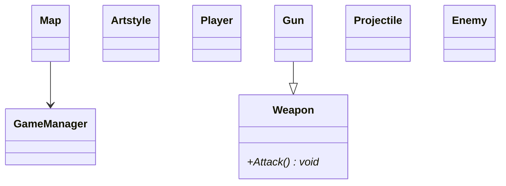

To open, use Obsidian or another program which supports Mermaid class diagram syntax: https://mermaid-js.github.io/mermaid/#/classDiagram

```mermaid
classDiagram
class GameManager { }
class Map { }
Map --> GameManager
class Artstyle { }
class Player { }
class Weapon {
	+Attack()* void
}
class Gun { }
Gun --|> Weapon
class Projectile { }
class Enemy { }
```